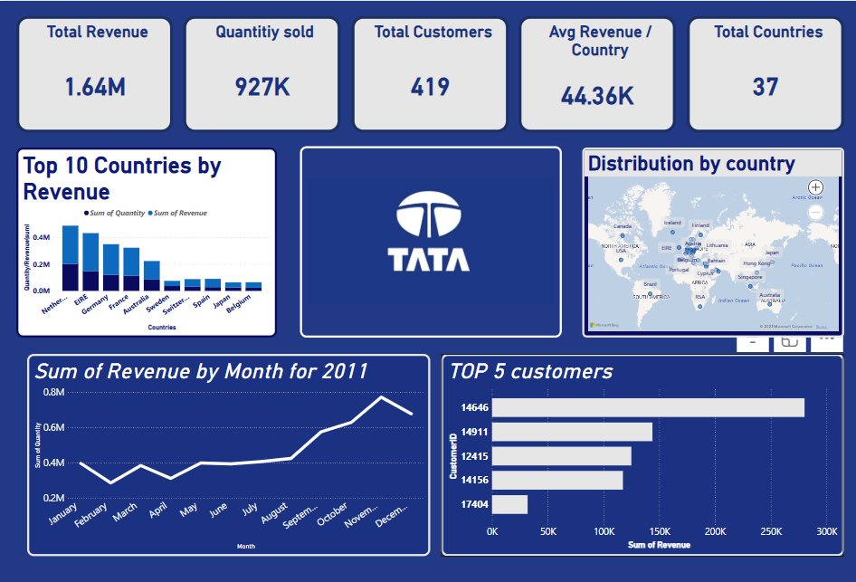

# Tata-Dashboard
1. Project Title / Headline
💼 Tata Revenue Insights Dashboard
A comprehensive, interactive data visualization tool designed to explore Tata's revenue and sales data across multiple regions and years.

2. Short Description / Purpose
The Tata Revenue Insights Dashboard is a detailed analytical tool that visualizes key revenue metrics, customer data, and regional performance for Tata. It is intended for business analysts, financial strategists, and company stakeholders to monitor trends and make data-driven decisions.

3. Tech Stack
The dashboard was built using the following tools and technologies:
• 📊 Power BI Desktop – Main data visualization platform used for report creation.
• 📂 Power Query – Data transformation and cleaning layer for reshaping and preparing the data.
• 🧠 DAX (Data Analysis Expressions) – Used for calculated measures, dynamic visuals, and conditional logic.
• 📝 Data Modeling – Relationships established among tables to enable cross-filtering and aggregation.
• 📁 File Format – .pbix for development and .png for dashboard previews.

4. Data Source
Source: Internal Tata financial records.

Data includes revenue, quantity sold, customer details, and country-wise performance for the years 2010 and 2011.

5. Features / Highlights
• Business Problem
Tata’s global operations generate substantial revenue, but stakeholders often struggle to quickly assess performance across regions and time periods without a centralized view. Questions like which countries contribute the most revenue or how revenue trends evolve annually are challenging to answer with raw data.

• Goal of the Dashboard
To provide an interactive visual tool that:
Enables users to explore Tata’s revenue and customer data.
Supports strategic decisions such as market expansion and resource allocation.
Uncovers trends in regional performance and customer engagement.

• Walkthrough of Key Visuals

Key KPIs (Top Left)
Total Revenue: 1.64M
Quantity Sold: 927K
Total Customers: 419
Average Revenue / Country: 44.36K
Total Countries: 37

Top 10 Countries by Revenue (Bar Chart)
Bar chart showing revenue and quantity sold for top countries like Sweden, Germany, and France.

Distribution by Country (World Map)
Map highlighting revenue distribution across 37 countries.

Sum of Revenue by Month for 2010 and 2011 (Line Chart)
Line graph depicting monthly revenue trends for both years.

Top 5 Customers (Bar Chart)
Bar chart listing the top 5 customers by revenue (e.g., CustomerID 14646, 14911).

• Business Impact & Insights
Market Analysis: Identify high-revenue countries for targeted marketing.
Customer Focus: Prioritize top customers for retention strategies.
Trend Monitoring: Track revenue growth over 2010 and 2011 to inform future planning.

6. Screenshots / Demos
7. 
8. 
